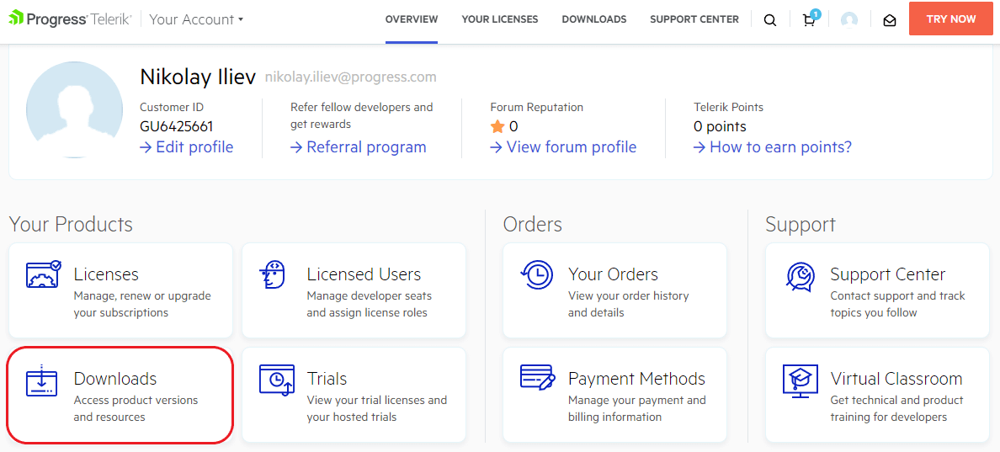
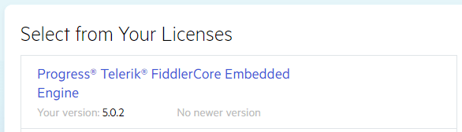
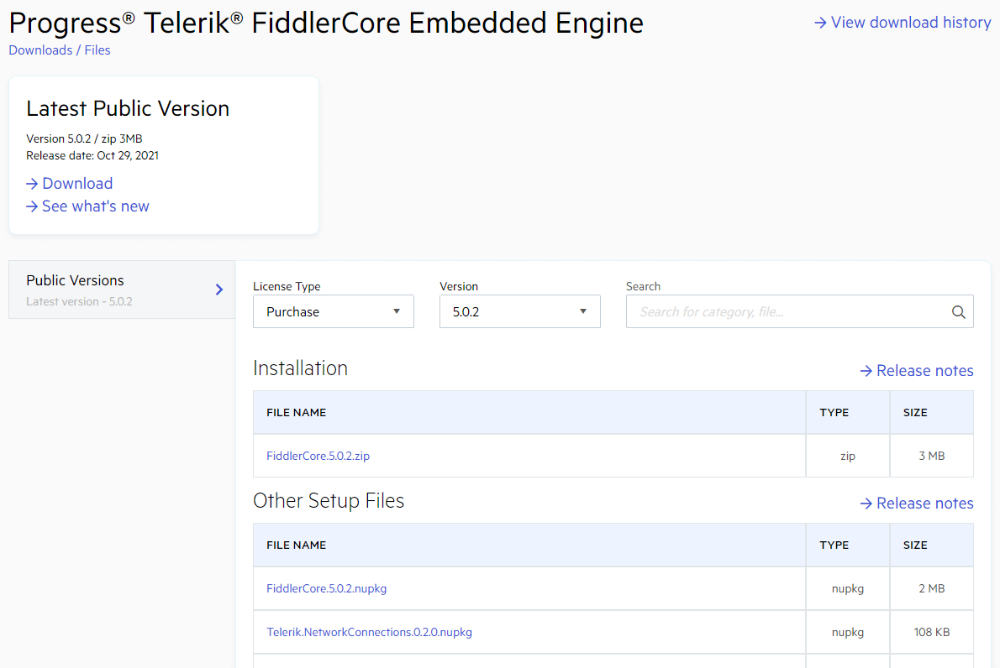

# Download Product Files

When you have an active trial or developer license, you can download the following files:

* FiddlerCore NuGet package for manual installation.
* Additional NuGet packages and extensions.
* Old versions of the FiddlerCore engine.

To download these, you need to take the following steps:

1. Log into your [Telerik account](https://www.telerik.com/account/).

1. Click on the **Downloads** tab:

    

1. Select **Progress Telerik FiddlerCore Embedded Engine** product title:

    

1. The download page allows you to obtain the following:

    - An archive that contains the latest FiddlerCore NuGet package (for manual installation), the [Bouncy Castle NuGet package](https://www.telerik.com/blogs/understanding-fiddler-certificate-generators), and the [Telerik Network Connections](https://docs.telerik.com/fiddlercore/api/telerik.networkconnections.networkconnection) Nuget package. 

    - Separate NuGet files for the latest FiddlerCore NuGet package (for manual installation), the [Bouncy Castle NuGet package](https://www.telerik.com/blogs/understanding-fiddler-certificate-generators), and the [Telerik Network Connections](https://docs.telerik.com/fiddlercore/api/telerik.networkconnections.networkconnection) Nuget package. 

    - Your FiddlerCore download history.

    - Quick access to the FiddlerCore release notes (through the **See what's new** link).

    

### Installation

The downloaded **FiddlerCore<version>.zip** contains the required Nuget packages. [Learn more about NUPKG files and how to use them...](https://fileinfo.com/extension/nupkg).

>tip Apart from downloading the Nuget package and installing it manually, you have the option to install and use your licensed FiddlerCore through the [Telerik Nuget servers]().

## Next Steps

- [FiddlerCore Configuration]()
