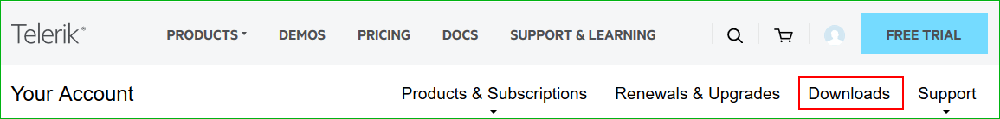
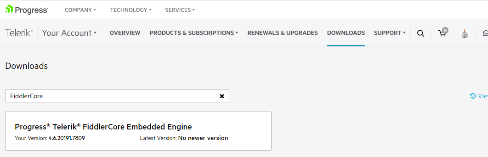
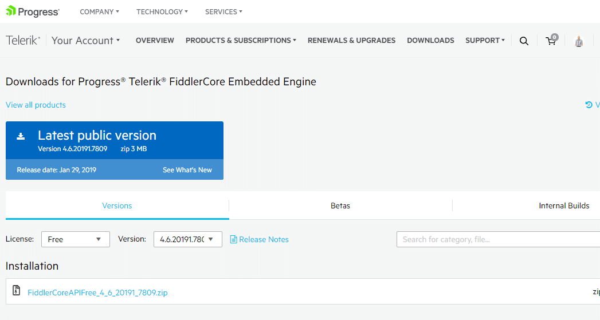

# Download Product Files

When you have an active trial or developer license, you can download the following files:

* Standalone installation
* Assemblies for manual installation
* NuGet packages
* Old versions

In order to download these you need to take the following steps:

**1. Log into your [Telerik account](https://www.telerik.com/account/).**

**2. Click on the __Downloads__ tab:**

**3. Select __FiddlerCore__ product title:**

**4. The next page allows you to download the Automatic Installation msi file, DLLs and NuGet Packages.**

Below you could find a list of the available files:

>[license] could be Trial or Dev depending on the license you have.

>[version] is replaced with the version the file corresponds to.

### Installation

* FiddlerCoreEmbeddedEngine[version]_[license].zip - contains the required .

## Next Steps

- [FiddlerCore Configuration](slug://configuration)
