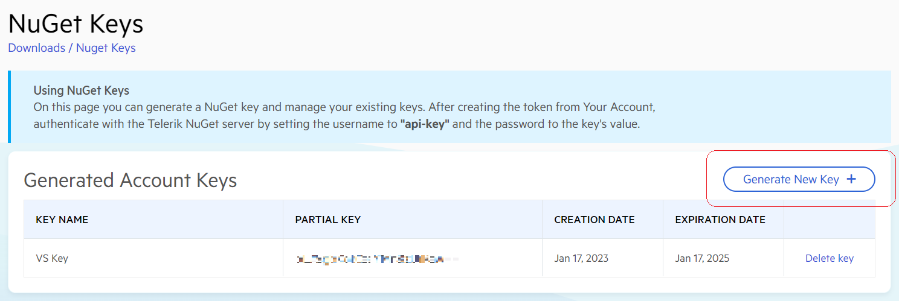

# Generating and Using Telerik NuGet Key

Progress Telerik expanded the account sign-in and login options, and now you can create a Telerik account through Google Authentication or by using custom SSO providers. While that change aims to ease the accessibility and usage of the whole Telerik system, it also presents a challenge for those who want to use a NuGet library through the Telerik NuGet server.

## Why and How to use a NuGet Key

The main reason is that you can quickly and efficiatenly set your NeGut key within the application configuration and forget about Nuget credentials.

Additionally, some Telerik products (like [FiddlerCore](https://docs.telerik.com/fiddlercore/getting-started/telerik-nuget-server) or [Kendo UI](https://docs.telerik.com/kendo-ui/intro/installation/nuget-install)) are available through the Telerik NuGet server which requires authentication. Until recently, you could only use your Telerik account credentials to authenticate with the Telerik NuGet server. However, a Telerik account that uses Google Authentication or custom SSO will notice no direct SSO login option to access the NuGet servers, and entering a username & password is a no-go. Luckily, the Progress Telerik team developed NuGet keys which can be used instead of the conventional username & password paradigm. 

>tip NuGet keys are helpful not only for Telerik users with Google Auth or SSO accounts but also for CI users and desktop developers. Learn more about the NuGet keys and how to use them by reading [this excellent blog post by Lance McCarthy](https://www.telerik.com/blogs/announcing-nuget-keys).

### Generating a NuGet Key

Generating a key for the Telerik NuGet server (https://nuget.telerik.com/v3/index.json) is fast and easy:

1. Open the [NuGet keys management page](https://www.telerik.com/account/downloads/nuget-keys). Alternatively, navigate to that page through **Account Overview** > **Downloads** > **Manage NuGet Keys**

1. Click the **Generate Key** button to create a new NuGet key. 

1. Copy and then store the value before replacing the contents of your clipboard. Note that this is the only time that you will see the key. Each generated key is valid for two years (or until explicitly deleted).



### Using the NuGet Key for Authentication

Instead of entering a username and password through a Visual Studio prompt or a CLI command, the NuGet key must be provided through the NuGet.Config file. 

You have the option to create a NuGet.Config file on the application level (it will overwrite any global NuGet.Config files and configuration will be applicable only for the specific application) or to use a global NuGet.Config file (it will be valid for all applications unless explicitly overwritten by an application NuGet.Config file). [Learn more details about NuGet.Config configuration and location on each operating system here...](https://learn.microsoft.com/en-us/nuget/consume-packages/configuring-nuget-behavior)

1. Close all instances of Visual Studio.

1. Navigate to the directory where the NuGet.Config file resides. [Learn where is the location of NuGet.Config on each operating system here...](https://learn.microsoft.com/en-us/nuget/consume-packages/configuring-nuget-behavior#config-file-locations-and-uses)

1. Open the NuGet.Config file or create one if the file does not exist.

1. Add the Telerik NuGet server in the package source section through a custom key (in the demo case, the key is named **MyTelerikFeed**)

1. Add the generated Telerik NuGet key in the `packageSourceCredentials` section:

   1. Add a `Username` key with the value `api-key`
   
   1. Add a `ClearTextPassword` key with the value of the generated Telerik NuGet key.

    ```XML
    <?xml version="1.0" encoding="utf-8"?>
    <configuration>
        <packageSources>
            <clear/>
            <add key="nuget.org" value="https://api.nuget.org/v3/index.json" protocolVersion="3" />
            <add key="MyTelerikFeed" value="https://nuget.telerik.com/v3/index.json" protocolVersion="3"/>
        </packageSources>
        <packageSourceCredentials>
            <MyTelerikFeed>
                <add key="Username" value="api-key" />
                <add key="ClearTextPassword" value="%MY_API_KEY%" />
            </MyTelerikFeed>
        </packageSourceCredentials>
    </configuration>
    ```

    >Always use the `ClearTextPassword` option (not `Password`). Note that while you can directly copy/paste the Telerik NuGet key, it is not a good practice in terms of security. You can learn how to protect your API key from [Lance's blog post on NuGet keys](https://www.telerik.com/blogs/announcing-nuget-keys).

1. Re-open your .NET application in Visual Studio and restore the NuGet packages.

That's it! With the above configuration in place, you can now access the Telerik NuGet and download & install the needed libraries without entering credentials.