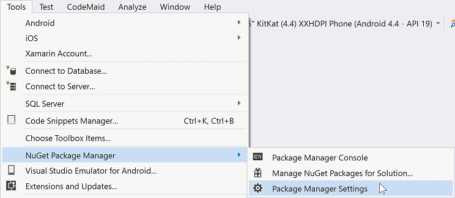
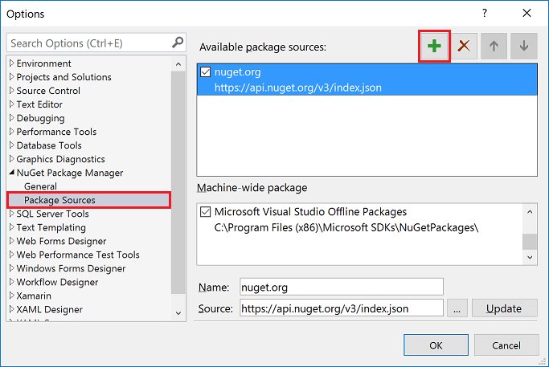
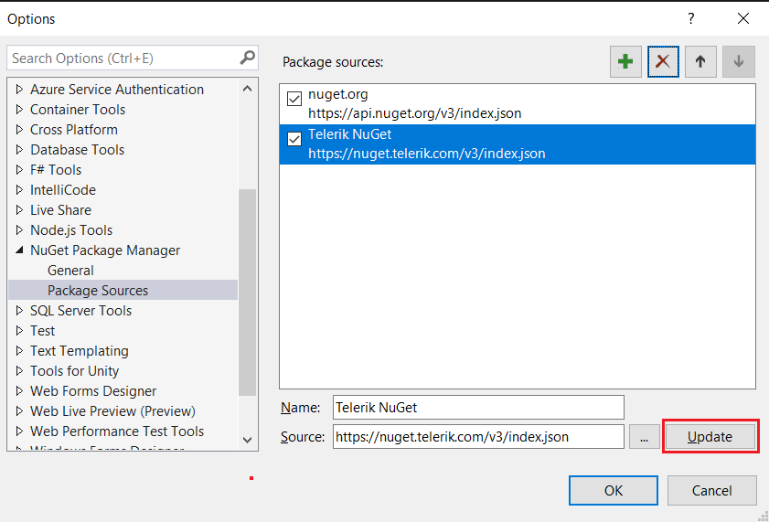
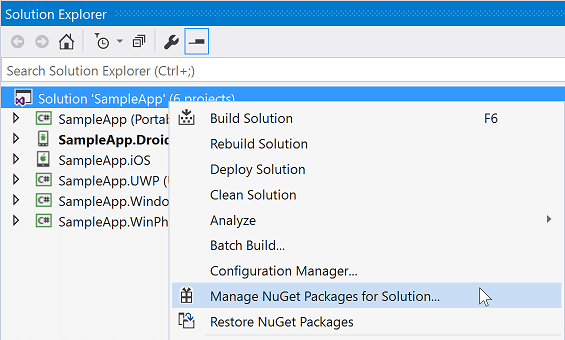
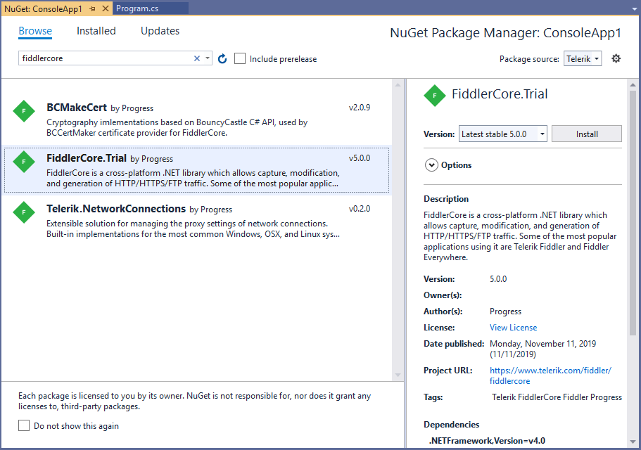

# Telerik NuGet Server

The following steps demonstrate how users can use the Telerik NuGet server to include our suite in their solution and/or update to the latest available version.

The credentials needed to access the Telerik NuGet server are the same as you use to log into your [Telerik account](https://www.telerik.com/account). The recommended approach to authenticate is to [generate](#generating-a-nuget-key) and [use](#using-the-nuget-key-for-authentication) the Telerik NuGet key.

## Visual Studio

The first step is to add the Telerik server to the NuGet package sources. This can be done in the Package Manager Settings from the Tools menu.

In the Package Sources section, users can add new sources.

In the Source field, users should fill in the address of the Telerik server (URL: **https://nuget.telerik.com/v3/index.json**) and click the Update button.

>important The previous version of the Telerik NuGet server (https://nuget.telerik.com/nuget) will be deprecated. Update your settings to point to the new v3 API (URL: **https://nuget.telerik.com/v3/index.json**), which is faster, lighter, and reduces the number of requests from NuGet clients. 

The Telerik server is now ready to use. Users can go to their solution and open the solution package manager.

Users have to find the **FiddlerCore** package and install it to their projects following these steps:

1. Select the Telerik server as a package source and enter their credentials when prompted.
1. Search for the FiddlerCore package.
1. Select the package when found.
1. Select which projects will have the package installed.
1. Choose the desired version and click Install.

>tip You will need to autheticate when usiong the Telerik NuGet server. The recommended approach is to [generate and use a Telerik NuGet key]().

## Troubleshooting

#### Receiving 401 Logon failed Error

If you're receiving this error when connecting to Telerik Nuget Server, you could try to update your NuGet credentials through the Windows Credential Manager. Please follow the steps below:

1. Close all open Visual Studio instances (this is so that all NuGet package manager tasks are stopped);
1. Open the "Credential Manager" app on your PC;
1. Scroll through all the entries until you find any that are for nuget.telerik.com;
1. Once you find that entry, expand it and select "edit";
1. Make sure the username and password are the same ones you use for your Telerik account (use the Email in the place of username) and click "Save".

Now, you can reopen Visual Studio and access the Telerik NuGet server. 

## Next Steps

- [FiddlerCore Configuration]()
